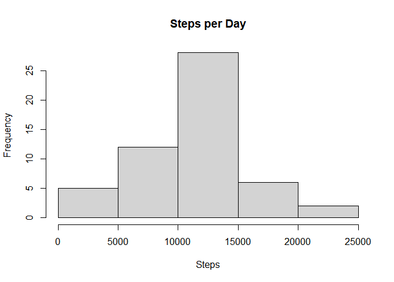
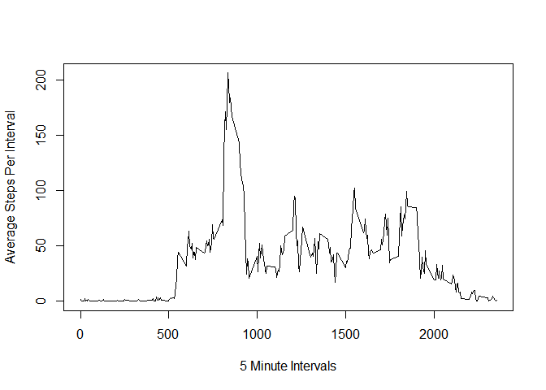
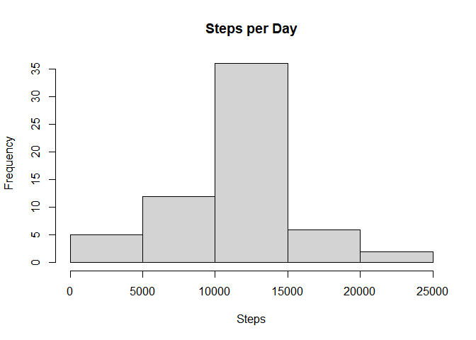
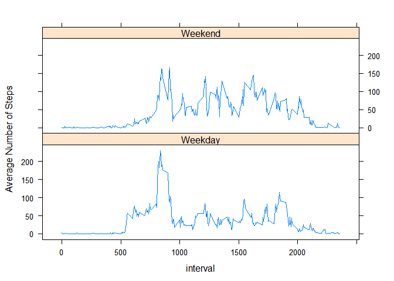

## Loading and preprocessing the data


```r
# Unzip the .zip file
library ("downloader")
url = 'https://d396qusza40orc.cloudfront.net/repdata%2Fdata%2Factivity.zip'
download(url, dest="dataset.zip", mode="wb") 
unzip ("dataset.zip", exdir = "C://Users//ktkni//OneDrive//Desktop//project1")

# Import text file.
data = read.csv("activity.csv")
```
## What is mean total number of steps taken per day?  Calculate the sum, mean, and median of the number of steps.  Create a histogram of the frequency of the sum of the number of steps per day.


```r
#Calculate the total number of steps taken per day

library (dplyr)
```

```
## 
## Attaching package: 'dplyr'
```

```
## The following objects are masked from 'package:stats':
## 
##     filter, lag
```

```
## The following objects are masked from 'package:base':
## 
##     intersect, setdiff, setequal, union
```

```r
sumofsteps <- data %>% group_by (date) %>% summarise (sum = sum (steps))
```

```
## `summarise()` ungrouping output (override with `.groups` argument)
```

```r
sumofstepssum <- sumofsteps$sum

# Calculate the total number of steps taken per day

sum = sum (sumofstepssum, na.rm = TRUE)
mean = mean (sumofstepssum, na.rm = TRUE)
median = median (sumofstepssum, na.rm = TRUE)

print (paste0("This is the sum:", sum))
```

```
## [1] "This is the sum:570608"
```

```r
print (paste0("This is the mean:", mean))
```

```
## [1] "This is the mean:10766.1886792453"
```

```r
print (paste0("This is the median:", median))
```

```
## [1] "This is the median:10765"
```


```r
hist (sumofstepssum, main = "Steps per Day", xlab = "Steps")
```

<!-- -->

## What is the average daily activity pattern?  Which 5-minute interval contains the maximum number of steps?


```r
#Calculate the total number of steps taken per day

library (dplyr)

averageofinterval <- data %>% group_by (interval) %>% summarise (average = mean (steps, na.rm = TRUE))
```

```
## `summarise()` ungrouping output (override with `.groups` argument)
```

```r
plot (averageofinterval$interval, averageofinterval$average, type = "l", xlab = "5 Minute Intervals", ylab = "Average Steps Per Interval")
```

<!-- -->


```r
#Calculate the total number of steps taken per day

library (dplyr)

averageofinterval <- data %>% group_by (interval) %>% summarise (average = mean (steps, na.rm = TRUE))
```

```
## `summarise()` ungrouping output (override with `.groups` argument)
```

```r
maxaverage <- max (averageofinterval$average)

highestinterval <- averageofinterval %>% filter (average == maxaverage)

print (paste0("This is the interval that the highest average steps belong to: ", highestinterval$interval))
```

```
## [1] "This is the interval that the highest average steps belong to: 835"
```
## Imputing missing values. First, calculate the mean of the NA.  Then, replace the NA with the mean of the interval.


```r
numberofNA <- sum(is.na(data))

print (paste0("This is the number of NA: ", numberofNA))
```

```
## [1] "This is the number of NA: 2304"
```


```r
MeanIntervalReplaceNA<-function(interval){
    averageofinterval[averageofinterval$interval==interval,]$average
}
```


```r
datawithoutna <- data

for(i in 1:nrow(datawithoutna)){
    if(is.na(datawithoutna[i,]$steps)){
        datawithoutna[i,]$steps <- MeanIntervalReplaceNA(datawithoutna[i,]$interval)
    }
}
```


```r
numberofwithoutNA <- sum(is.na(datawithoutna))

print (paste0("This is the number of NA: ", numberofwithoutNA))
```

```
## [1] "This is the number of NA: 0"
```


```r
#Calculate the total number of steps taken per day

library (dplyr)

sumofstepswithoutna <- datawithoutna %>% group_by (date) %>% summarise (sum = sum (steps))
```

```
## `summarise()` ungrouping output (override with `.groups` argument)
```

```r
# Calculate the total number of steps taken per day

sum1 = sum (sumofstepswithoutna$sum)
mean1 = mean (sumofstepswithoutna$sum)
median1 = median (sumofstepswithoutna$sum)

print (paste0("This is the sum:", sum1))
```

```
## [1] "This is the sum:656737.509433962"
```

```r
print (paste0("This is the mean:", mean1))
```

```
## [1] "This is the mean:10766.1886792453"
```

```r
print (paste0("This is the median:", median1))
```

```
## [1] "This is the median:10766.1886792453"
```

```r
hist (sumofstepswithoutna$sum, main = "Steps per Day", xlab = "Steps")
```

<!-- -->

## Are there differences in activity patterns between weekdays and weekends?


```r
datawithoutna$date <- as.Date(strptime(datawithoutna$date, format="%Y-%m-%d"))
datawithoutna$day <- weekdays(datawithoutna$date)
```


```r
for (i in 1:length(datawithoutna$day)){
  if (datawithoutna$day[i] == "Saturday"|datawithoutna$day[i] == "Sunday"){
    datawithoutna$timeofweek[i] <- "Weekend"
  }else{
    datawithoutna$timeofweek[i] <- "Weekday"
  }
}
```


```r
library (dplyr)
library (lattice)

datawithoutnaforgraph <- datawithoutna %>% group_by (timeofweek, interval) %>% summarise (average = mean (steps))
```

```
## `summarise()` regrouping output by 'timeofweek' (override with `.groups` argument)
```

```r
xyplot (average ~ interval|timeofweek, type = 'l', data = datawithoutnaforgraph, layout=c(1, 2), ylab = "Average Number of Steps")
```

<!-- -->
